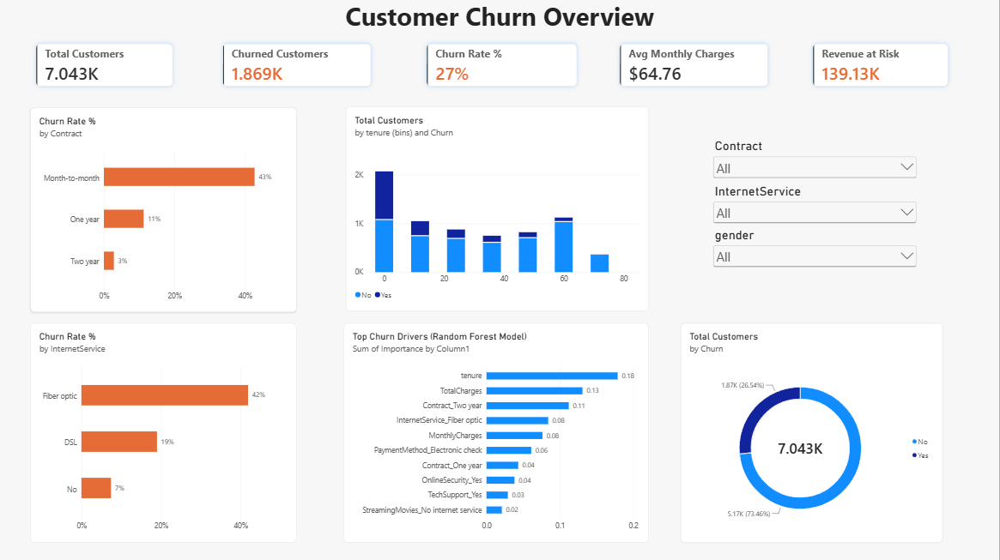

# Customer Churn Prediction & Retention Insights

## Problem Statement:

Telecom companies lose significant recurring revenue every month to customer churn, but retention budgets are limited — offering discounts or perks to every customer is expensive and inefficient. The business needs to know which customers are most likely to churn and why, so retention efforts (discounts, proactive support calls, contract upgrade offers) can be targeted at high-risk, high-value customers instead of everyone.

**This project analyzes historical customer data to identify churn drivers, builds a predictive model to flag at-risk customers, and turns the results into a dashboard a retention team could actually use.**


## Dataset:
https://www.kaggle.com/datasets/blastchar/telco-customer-churn
Telco Customer Churn — 7,043 customers, 21 features (demographics, account info, services subscribed).

# Tools & Skills Used :
- Python: Pandas, NumPy for cleaning and feature engineering
- Matplotlib / Seaborn: exploratory data analysis
- Scikit-learn: Logistic Regression + Random Forest classification
- Power BI: interactive dashboard for business stakeholders

# Approach :
1. Cleaned data (fixed TotalCharges type issue, handled missing values).
2. Explored churn patterns across contract type, tenure, charges, and service type.
3. Engineered features (encoding categorical variables, scaling numeric ones).
4. Trained and compared two models: Logistic Regression (interpretable baseline) and Random Forest (better recall).
5. Extracted feature importance to identify the strongest churn drivers.
6. Built a Power BI dashboard combining the EDA visuals, model output, and filters for department-level exploration.

# Key Findings:
- Contract type: Month-to-month contracts drive the highest churn rate at 43%, compared to 1-year (11%) and 2-year (3%) contracts.
- Tenure: The lowest tenure bin (0 months) contains the highest absolute volume of churned customers. Churn risk steadily decreases as customer tenure increases.
- Monthly charges: The average monthly charge for the customer base is $64.76. Both TotalCharges and MonthlyCharges rank within the top 5 predictive features for churn.
- Top 3 model features: According to the Random Forest model, the strongest churn drivers are 1. tenure (0.18), 2. TotalCharges (0.13), and 3. Contract_Two year (0.11).
  
# Business Recommendations:
- **Incentivize Contract Upgrades**: Month-to-month users have a 43% churn rate. Offer targeted discounts to transition them to 1-year or 2-year plans.
- **Investigate Fiber Optic Services**: With a 42% churn rate, fiber optic requires an immediate review of network reliability and pricing satisfaction.

## Model Performance :
| Model | Accuracy | Precision | Recall | F1 | ROC-AUC |
| --- | --- | --- | --- | --- | --- |
| Logistic Regression | | | | | |
| Random Forest | | | | | |

## Dashboard Preview :


## 📂 Repository Structure:
```
│
├── datasets/                           # Raw datasets used for the project│
|
├── churn_prediction_project.py
├── WA_Fn-UseC_-Telco-Customer-Churn.csv
├── outputs/                            # generated charts and model_comparison.csv
|
├── dashboard/                          # Power BI .pbix file + screenshot
|
└── README.md
├── .gitignore                          # Files and directories to be ignored by Git
└── requirements.txt                    # Dependencies and requirements for the project

```
